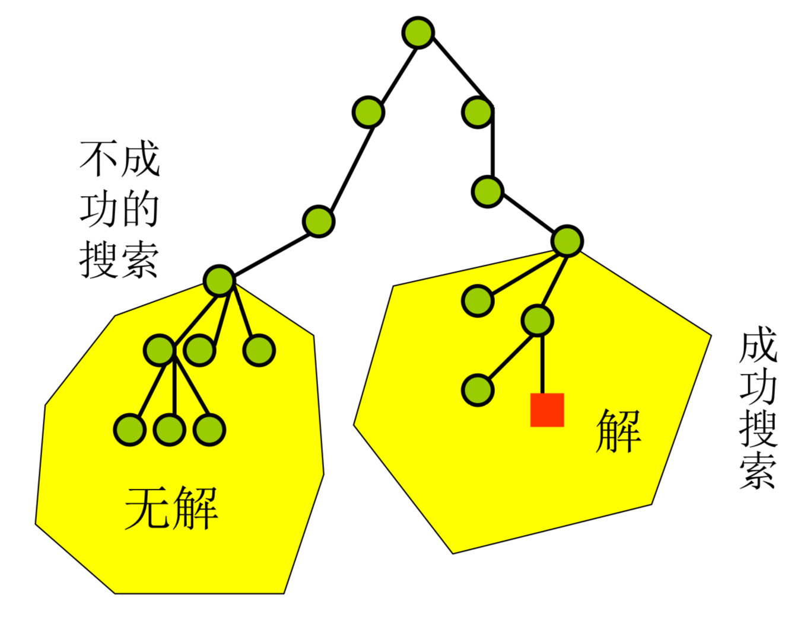

<!-- _class: cover_e hugetext -->
<!-- _footer:  -->
<!-- _paginate: "" -->

# &nbsp;随机算法（一）

###### &nbsp;——两类随机算法的概念与例子

&nbsp;goudanZ1
&nbsp;2025.5.30
 

## 从近似算法到随机算法

<!-- _class: hugetext fixedtitleA -->

对难以**在多项式时间内找到最优解**的问题，我们有两种尝试解决的方法：

- **近似算法**：确定性算法，在多项式时间内虽然不一定能找到最优解，但可以找到足够好的近似解

- **随机算法**：非确定性算法，在多项式时间内希望通过 “随机” 来尽快接近最优解或正确答案

---

<!-- _class: hugetext -->

## 随机快速排序算法

<!-- _class: hugetext fixedtitleA -->

- 流程：对给定数组，从数组中**随机**选择一个元素作为轴元素，遍历数组进行原地换序，把小于轴元素的元素放到它的左边，大于它的元素放到它的右边，然后对左边和右边的子数组分别递归排序

- 传统快速排序中，轴值的选取通常是固定的，比如总是选择数组的第一个元素作为轴值

- 期望运行时间：$T(n)=(n-1)+\frac{1}{n}\Sigma_{i=0}^{n-1}{\left [ T(i)+T(n-i-1)\right ]}$，这里轴元素在换好序后的数组中排在第几位是随机的，在各个位置的概率都是 $\frac1n$

- 仍然有 $T(n)=\Theta(n\log{n})$，可以进一步证明 $T(n)\le2n\ln{n}$

## 随机选择算法

<!-- _class: hugetext fixedtitleA -->

如何从一个给定数组中选择第 $k$ 小的元素？

- 流程：对给定数组，从数组中**随机**选择一个元素作为轴元素，遍历数组进行原地换序，把小于轴元素的元素放到它的左边，大于它的元素放到它的右边（似曾相识）。

- 如果小于等于轴元素的数已经有至少 $k$ 个了，只需从左半边选择第 $k$ 小的元素；否则第 $k$ 小的数在右半边，设小于等于轴元素的数有 $t$ 个，则只需从右半边选择第 $k-t$ 小的元素（分治）

- 正经的分治算法是 $O(n)$ 的，这里花里胡哨地随机了一下，仍然是 $O(n)$ 的

## $n$皇后问题的随机算法

<!-- _class: hugetext fixedtitleA -->

感觉比较有启示意义

- 回顾一下**回溯法**：一行一行处理，每次考虑这一行所有可行的皇后位置选法，**依次尝试**，选择好这一行的位置后接着对下一行的位置依次尝试

- 随机算法：也是一行一行处理，每次考虑这一行所有可行的皇后位置选法，**从中随机猜一个**，选择好这一行的位置后接着猜下一行的位置；若没有可选的位置，说明前面猜错了

- 猜错了怎么办？没错，回到第一行重新开始新一轮猜测，一轮一轮猜直到猜出一个可行解

## $n$皇后问题的随机算法——改进

<!-- _class: hugetext fixedtitleA -->

**问题（高开低走）**：有时候明明前几行猜的是对的，但是后几行猜错了，这时也要直接全部放弃，从头开始重新猜，好像有些可惜

**改进**：提前设定好，只有前 $k$ 行采用随机算法猜一组位置选法，一旦选好，对剩下的 $n-k$ 行采用回溯算法，遍历所有可能的位置组合，这样就不必担心正确的前 $k$ 行选法被后面拉胯的猜测拖累，从而被掩埋在历史的尘埃中

- 可调节性强，$k$ 取 $n$ 即为完全随机算法，$k$ 取 $0$ 即为完全回溯算法

## $n$皇后问题的随机算法——改进

<!-- _class: hugetext fixedtitleA -->

- **随机算法**每轮猜测的代价很少，获得的收益也低，极大概率猜不到一个可行解，而且在获得完整的可行解之前根本不知道之前的猜测好不好

- **回溯算法**的代价很大，需要遍历所有的选法，但相对应地收益较高，如果前 $k$ 行位置的选法是对的就可以立刻找到可行解，不必再接着随机

## 新的问题：选择比努力更重要

<!-- _class: hugetext fixedtitleA cols-2-64-->

错误的选择可能会耗费过多的精力，在错误的道路上回溯着回溯着可能心里就没底了，是否有必要继续遍历下去呢？

 
 

#### → MCTS
#### （蒙特卡洛树搜索）

## 两类随机算法

<!-- _class: hugetext fixedtitleA -->

- **有效的 Las Vegas 算法**（随机快排，随机选择，随机$n$皇后）：
  
  - 将确定性算法的某一步改成随机选择 
  - 运行时间是随机变量，取决于中间“随机”的那步猜得好不好，但运行时间期望是多项式级的
  - 总是能给出正确答案

- **有效的 Monte Carlo 算法**
  
  - 在多项式时间内尝试给出看起来最像正确答案的答案，有时会给出错误的答案
  - 时间越充足，尝试次数越多，出错概率越低

## 串相等测试

<!-- _class: hugetext fixedtitleA -->

二进制串 $x$ 和 $y$ 是否相等？直接传送整个串并进行比较，占用时空资源太大

- 设 $x$ 所对应的正整数为 $I(x)$，$y$ 所对应的正整数为 $I(y)$，取一个公共的大素数 $p$，如果 $I(x)$ 和 $I(y)$ 模 $p$ 的余数不相等，则串 $x$ 和 $y$ 一定不同。

- **Monte Carlo 算法**：只需要一方将选择的 $p$ 和自己的数模 $p$ 的余数发给对方，若两数的余数不同，则判断 $x$ 和 $y$ 不同，否则判断 $x$ 和 $y$ 相同（?）

- **问题**：如果 $I(x)$ 和 $I(y)$ 模 $p$ 的余数恰好相同，那就无法十分有把握地推出 $I(x)$ 和 $I(y)$ 相同，进而串 $x$ 和 $y$ 相同

- 但事实上这个把握应该还是有八九分的，不太可能随手选一个大素数就选到了 $I(x)-I(y)$ 的素因子！

## 串相等测试

<!-- _class: hugetext fixedtitleA -->

- 设串 $x$ 和 $y$ 的位数为 $n$，如果将素数 $p$ 的随机选取范围 $M$ 设置得足够大，可以做到：
  
  $P\{算法结果错误\}=P\{一个从范围 M 内随机选取的素数恰好是 I(x)-I(y) 的素因子\}$

  $=\frac{|I(x)-I(y)|在范围M内的素因子个数}{范围M内的素数个数}\le\frac{1}{n}$（这里 $|I(x)-I(y)|$ 也是不超过 n 位的）

- 连续如此测试 $k$ 次（选 $k$ 次素数），每次只要余数不同就能确认串 $x$ 和 $y$ 一定不相同，否则接着测试。最终结果还是错误（$x$ 和 $y$ 真的不同，但就是次次都恰好选到 $|I(x)-I(y)|$ 的素因子，只能认为 $x$ 和 $y$ 相同）的概率已经小至 $(\frac{1}{n})^k$。

---

<!-- _class: cover_d hugetext -->
<!-- _paginate: "" -->

# &nbsp;谢谢大家 ~

PPT 模版：<a href="https://github.com/goudanZ1/Awesome-Marp">https://github.com/goudanZ1/Awesome-Marp</a>
