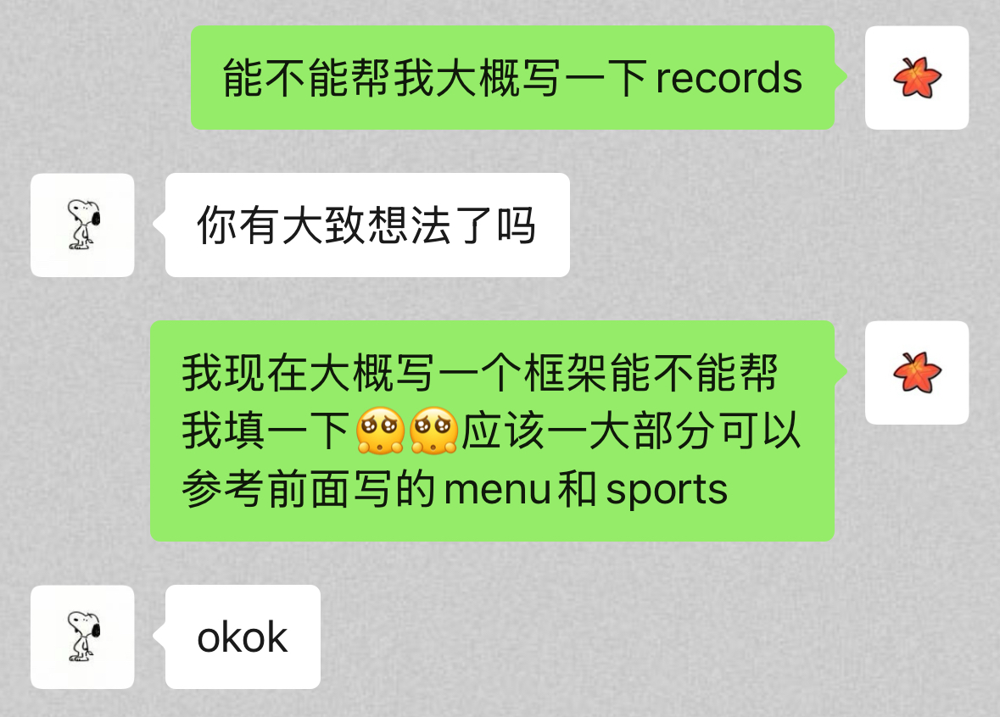

<!-- _class: cover_e hugetext -->
<!-- _footer:  -->
<!-- _paginate: "" -->

# &nbsp;PKUHealthier

###### 更适合 PKUer 的健康管理程序

yyttt6&nbsp;&nbsp;BubblerLIU&nbsp;&nbsp;goudanZ1
24 春《程序设计实习》
<br>

---

<!-- _class: toc_b hugetext -->
<!-- _header: 目录<br>-->
<!-- _paginate: "" -->

- 项目介绍与功能演示
- 经验分享

## 项目介绍

<!-- _class: hugetext fixedtitleA -->

**PKUHealthier**：更适合 PKUer 的健康管理程序

- 收集了燕园校区内大部分食堂的大部分菜品及其营养数据
- 根据用户的身体指标、饮食偏好等，个性化燕园食堂食谱推荐
- 菜品评价，好感度越高越容易被推荐
- 轻松记录饮食、运动数据，通过精美的图表使记录可视化
- 设计了有趣的隐藏成就，激励大家健康生活

> 致敬北大树洞的前身 PKU Helper

## 在开始之前

<!-- _class: hugetext fixedtitleA -->


## 在开始之前

<!-- _class: hugetext fixedtitleA -->

- **功能设计**

  - 这个软件是面向哪类用户？希望实现用户的哪些需求？

- **小组分工**
  - 推荐模式：前端 + 后端
  - 前端：设计用户界面，在用户执行特定操作时调用后端接口，并根据返回的数据来更新页面
  - 后端：接收来自前端的请求，根据前端传来的参数进行一定的运算或处理，然后返回前端需要的数据，过程中可能涉及本地文件读写

## 任务拆解：食堂食谱推荐

<!-- _class: hugetext fixedtitleA -->

用户点击按钮 → 触发前端函数 → 调用后端推荐函数 → 返回食谱，更新页面

- **后端**：大概是

  ```cpp
  class User {
  public:
      int height; bool eatSpicyFood; ...
      User() { 读取本地的用户数据文件，提取出上面的各种属性 }
      Meal recommendMeal(int canteenId) {
          读取本地的食堂数据文件，算出最合适的食谱并返回
      }
  }
  ```

## 任务拆解：食堂食谱推荐

<!-- _class: hugetext fixedtitleA -->

用户点击按钮 → 触发前端函数 → 调用后端推荐函数 → 返回食谱，更新页面
- **前端**：大概是
  ```cpp
  class Recommend {
  public:
      QComboBox* box; // 选择哪个食堂的选择框
      QPushButton* button; // 确认按钮
      Recommend() { box 和 button 长啥样，放哪里；
                    把 button 的点击信号映射到槽函数 onClick() }
  public slots:
      void onClick() { User user();
               meal = user.recommendMeal(box的选择); 更新页面 }
  }
  ```

## 先搭起一间毛坯房

<!-- _class: hugetext fixedtitleA -->

- 首先需要比较具体的小组分工，最好是大概定好每条需求由谁来做

- 后端同学设计好自己的类和接口（函数），不用具体实现，各个接口可以暂时先返回一些随意的数据，方便前端同学调试

- 前端同学 **需要花大量精力学习** Qt 中 QPushButton 等控件类的操作方法、QVBoxLayout 等布局管理器，先写出一个能点击的用户界面 Demo，再尝试调用后端的接口

## 保持和其他小组成员的沟通

<!-- _class: hugetext fixedtitleA -->

- 比如我是写前端的，写着写着发现后端的一个函数有 bug，我会~~暴跳如雷~~儒雅随和地向后端同学指出问题，并附上详细的错误情况说明
- 比如我的开发进度比预期偏慢，眼看就要 DDL 了，我会跪求另一个前端同学帮我分担一点



## 实现细节-后端

<!-- _class: hugetext fixedtitleA -->

#### &nbsp;数据维护：

- `Man` 类用于统一维护与用户相关的信息，包括饮食、运动、成就信息

- `Meal` 类用于抽象每顿饭的饮食情况，包括饮食内容、营养成分等

- `Dish` 类用于抽象每份菜的情况，包括菜品类别、营养成分等

- `Café` 类用于抽象每个餐厅的情况，主要包括各类菜品

## 实现细节-后端

<!-- _class: hugetext fixedtitleA -->

#### &nbsp;菜品推荐：

- 食堂中不同菜品的组合数很大，采用多线程，提高菜品推送效率

- 三个线程池，用于菜品组合、价值评估和存储时菜品的序列化

- 根据用户个人信息设计“权重向量”，与备选菜品的各个指标线性组合进行评分

- 引入随机性，让菜品有更丰富的变化

---

<!-- _class: cover_d hugetext -->
<!-- _paginate: "" -->

# &nbsp;谢谢大家 ~

项目地址：<a href="https://github.com/yyttt6/PKUHealthier">https://github.com/yyttt6/PKUHealthier</a>

PPT 模版：<a href="https://github.com/goudanZ1/Awesome-Marp">https://github.com/goudanZ1/Awesome-Marp</a>
